# Final test | `Deadline 27 March` | Individual Project
## Links: [Project Requirements](resources/GL%20Individual%20project%20description_2025.pdf) | [Github project](https://github.com/iPlugin/individual_project) | [GlobalLogic](https://www.globallogic.com/)

## Work in Progress
- Should be written in C/C++


- Target OS - Linux

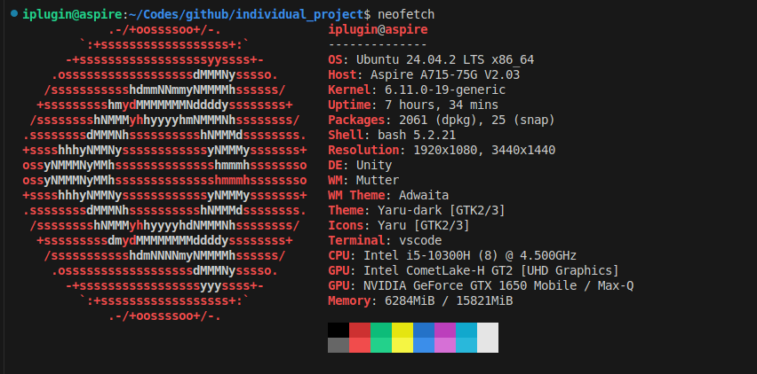

- Creation of a RAW sockets

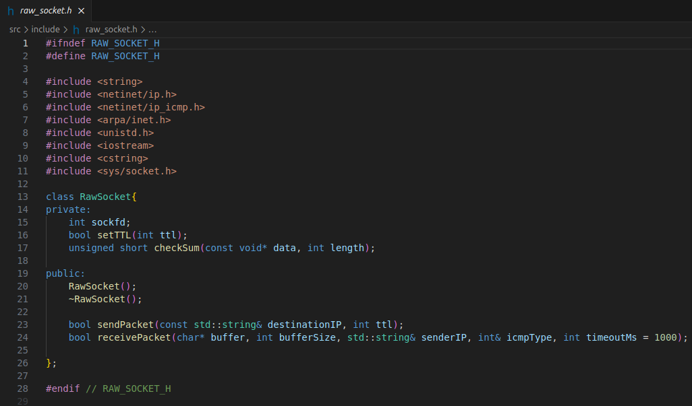

- Route display

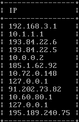

- Hop count limitation

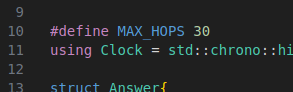

- Utility should discover and display domain name of each intermediate network node (if available).

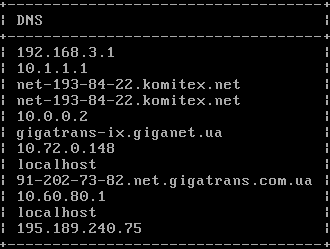

- User-friendly text-based output

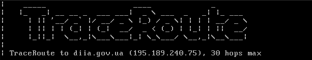

- Integration with OpenWrt

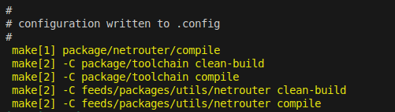

- The history of development should be available on git.


- Round Trip Time (RTT) measurement


- Error handling

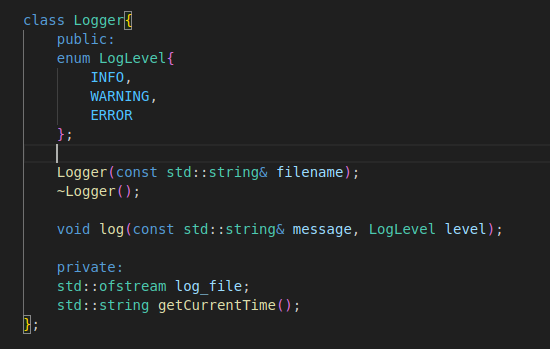

- Network interface selection

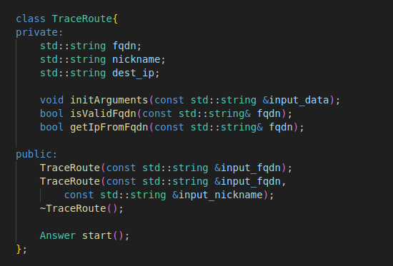

- FQDN, network interface and other options should be implemented as CLI arguments.

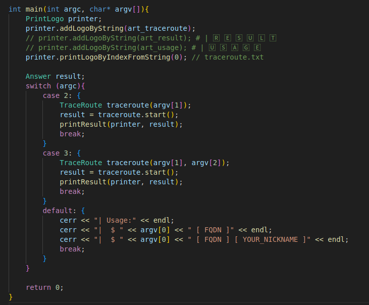


## Result

- Using FQDN + nickname
``` Bash
netrouter diia.gov.ua iPlugin
```

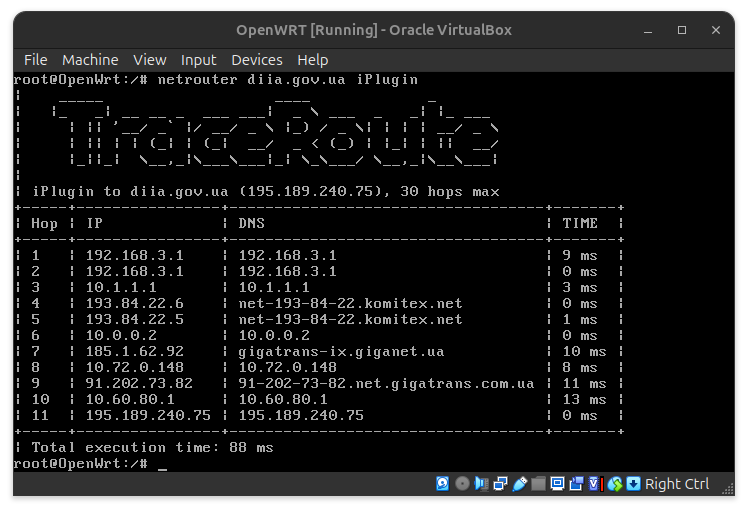

- Using IP
``` Bash
netrouter 8.8.8.8
```

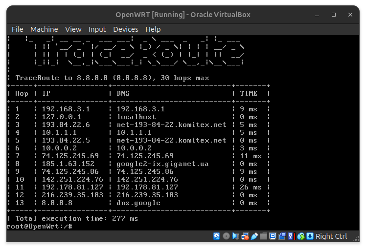

- Without args
``` Bash
netrouter
```

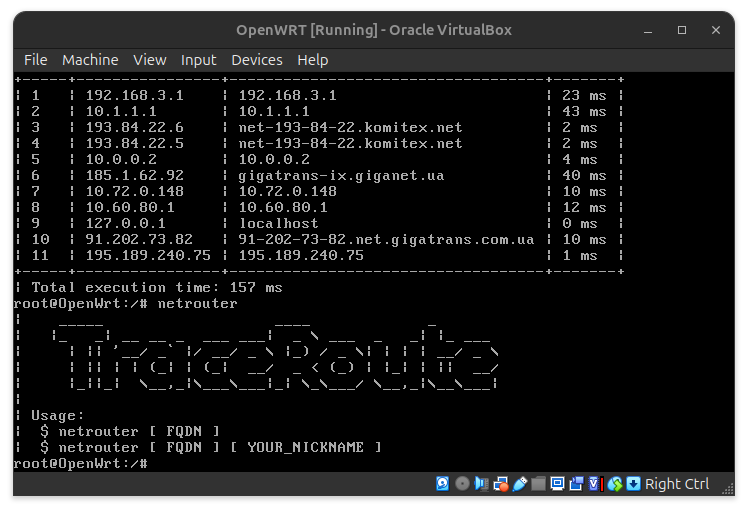