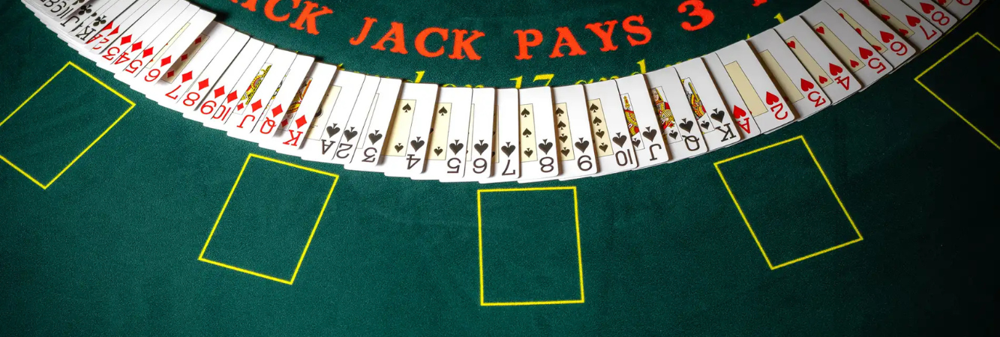

# BlackJack Game Application
This project is a QML-based implementation of a BlackJack card game. The application simulates a BlackJack game environment where players can place bets, interact with chips, and play against a virtual dealer.

## About the Task
This project was assigned by DCT as a test assignment. Below are the relevant links:
- Assignment details: [BlackJack Game Assignment](https://docs.google.com/document/d/1_R8isccptNL_9gy_WgMp_NEmbaDiDvv2mBeJJ3aDrbI/edit?usp=sharing)
- Feedback received: [Feedback on the Implementation](https://docs.google.com/document/d/1DLVzDLBVs1E51B7ciQde6fP6sspsltKGibOaqcXeisc/edit?usp=sharing)

## Features
### Game Flow
Betting System: Players can place bets using virtual chips of various denominations (10, 25, 50, 100).
### Card Dealing: Animations reveal cards dealt to both the dealer and the player.
### Game Actions:
- Play: Begin the game by placing a bet.
- Hit: Request an additional card.
- Stand: End the player's turn and allow the dealer to reveal their cards.
- Restart: Reset the game for a new round.
- Return Chips: Undo the current bet and retrieve chips back into the balance.
### Animations
- Smooth transitions for cards dealt to the dealer and the player.
- Visual updates for game states like winning, losing, or drawing.
### Responsive UI
- Background dynamically adjusts based on game themes.
- Visible and intuitive controls for game interactions.

## How to Run the Application
1) Prerequisites:
- Qt framework installed on your system (version 6.x recommended).
- Ensure that your project folder contains the required resources:
    - resources/tables/
    - resources/images/
    - resources/cards/
2) Execution:
- Open the project in Qt Creator or your preferred QML IDE.
- Run the main.qml file to launch the application.

## Folder Structure
```
    BlackJackGame/
    ├── resources/
    │   ├── images/
    │   │   ├── [images.png]
    │   ├── cards/
    │   │   └── [card images for dealer and player]
    │   └── tables/
    │       └── [table theme images]
    └── main.qml
```
