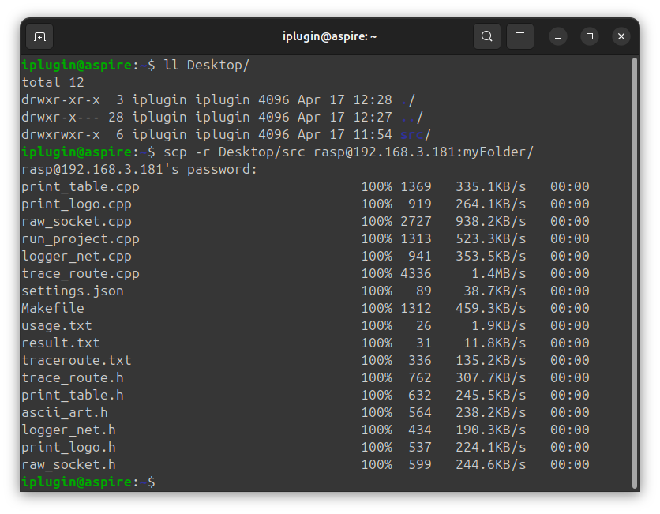
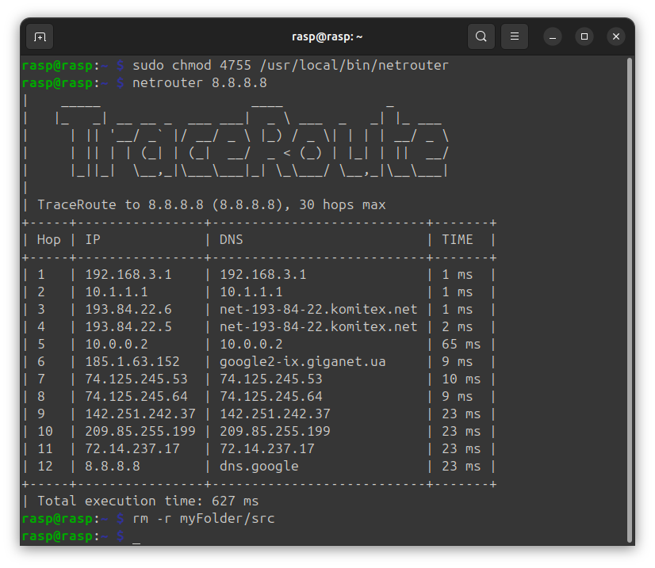
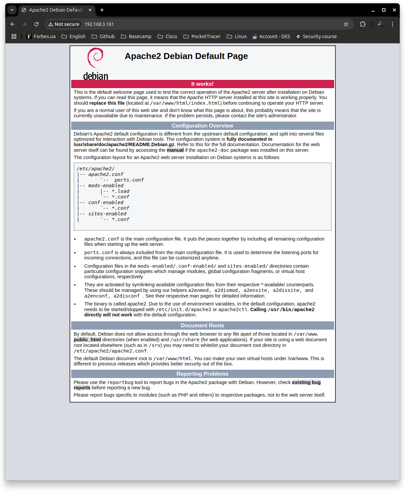
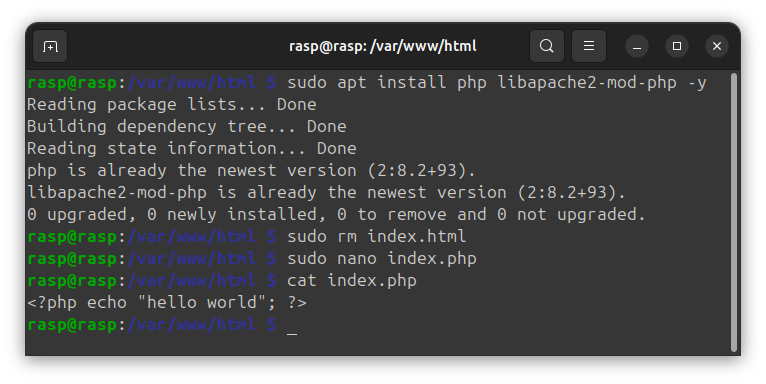

# Всім привіт 👋 Зміст:
- [Встановлення і налаштування RaspBerry](#встановити-операційну-систему-за-допомогою-imager)
- [Підключення по SSH](#робимо-підключення-по-ssh)
- [Перекидання файлів через SCP](#перекидаємо-папку-на-raspberry-через-scp)
- [Робота з S-bit](#запускаємо-netroute-на-raspberry)
- [Налаштування веб-сервер Apache](#налаштування-веб-сервер-apache)

## Встановити операційну систему за допомогою Imager

``` Bash
# aspire 192.168.3.155
wget https://downloads.raspberrypi.org/imager/imager_latest_amd64.deb
sudo apt install rpi-imager
rpi-imager
```

Вибираємо пристрій, вибираємо ОС і накопичувач


Edit settings


General


Services


Option


Yes


Yes


Continue


Встановлюємо SD в плату


Піключаємо живлення, Ethernet


## Робимо підключення по SSH

Скануємо всі ip в локальній мережі через nmap і шукаємо ip Raspberry

``` Bash
# aspire 192.168.3.155
sudo apt install nmap
sudo nmap -sn 192.168.3.0/24
```


``` Bash
# aspire 192.168.3.155
ssh rasp@192.168.3.181
```


## Перекидаємо папку на raspberry через SCP

Створюємо робочу дерикторію

``` Bash
# raspberry 192.168.3.181
mkdir myFolder
```


Перекидаємо папку

``` Bash
# aspire 192.168.3.155
ll Desktop/
scp -r Desktop/src rasp@192.168.3.181:myFolder/
```



``` Bash
# raspberry 192.168.3.181
cd myFolder/src
ls
make start
sudo chmod +x netrouter
sudo cp netrouter /usr/local/bin
make clean
cd ~
```

## Запускаємо netroute на raspberry

Посилання на цей [проєкт](https://github.com/iPlugin/projects/tree/main/cpp_openwrt_netrouter) є в моєму github

``` Bash
# raspberry 192.168.3.181
sudo chmod 4755 /usr/local/bin/netrouter
netrouter 8.8.8.8
rm -r myFolder/src
```



## Налаштування веб-сервер Apache

``` Bash
# raspberry 192.168.3.181
sudo apt update && sudo apt upgrade
sudo apt install apache2 -y
```


``` Google request
# aspire 192.168.3.155
Google request: 192.168.3.181
```



``` Bash
# raspberry 192.168.3.181
cd /var/www/html
ls -al
sudo chown rasp: index.html
```


Встановлення PHP для Apache

``` Bash
# raspberry 192.168.3.181
sudo apt install php libapache2-mod-php -y
sudo rm index.html
sudo nano index.php
cat index.php
```



``` Google request
# aspire 192.168.3.155
Google request: 192.168.3.181
```

