# Всім привіт 👋 Зміст:
- [Встановлення і налаштування RaspBerry](#встановлення-і-налаштування-raspberry)
- [Підключення по SSH до RaspBerry](#підключення-по-ssh-до-raspberry)
- [Перенесення PHP файлу через SCP](#перенесення-php-файлу-через-scp)
- [Налаштування веб-серверу Apache](#налаштування-веб-серверу-apache)

## Встановлення і налаштування RaspBerry

``` Bash
# aspire 192.168.3.155
wget https://downloads.raspberrypi.org/imager/imager_latest_amd64.deb
sudo apt install rpi-imager
rpi-imager
```

### Вибираємо пристрій, вибираємо ОС і накопичувач


#### Edit settings

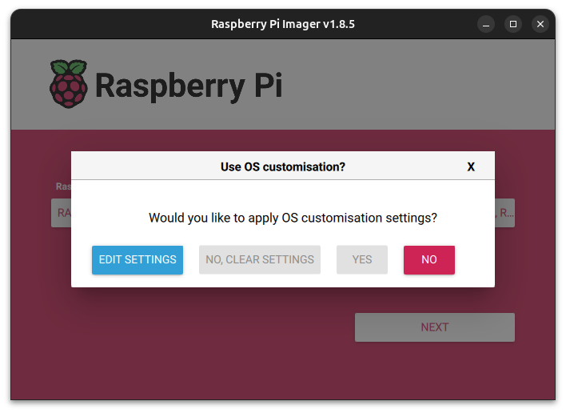

#### General

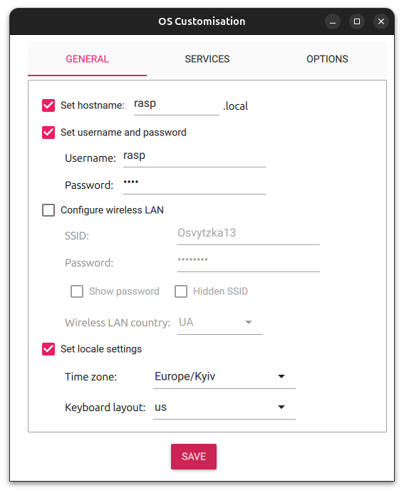

#### Services

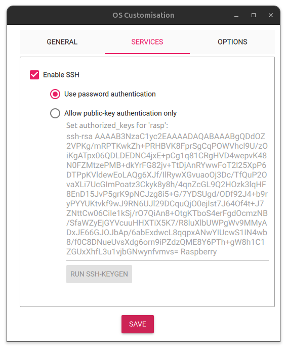

#### Option

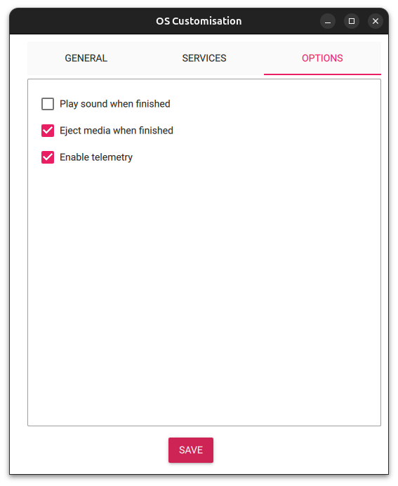

#### Yes

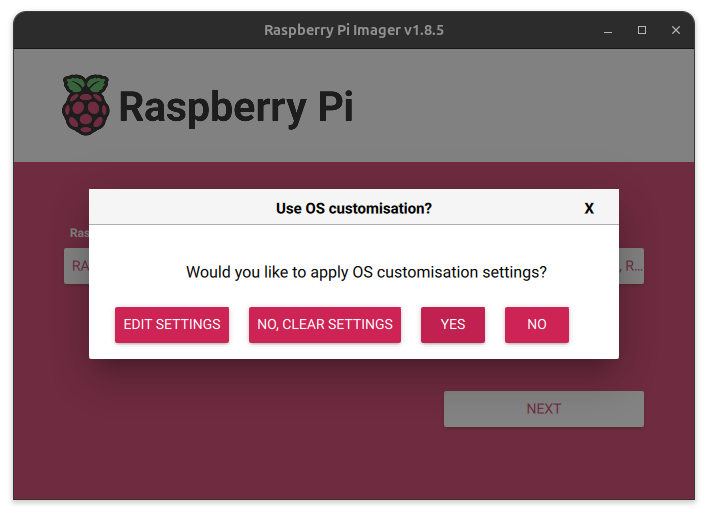

#### Yes

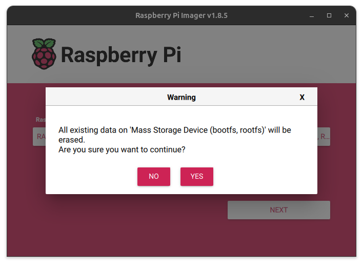

#### Continue

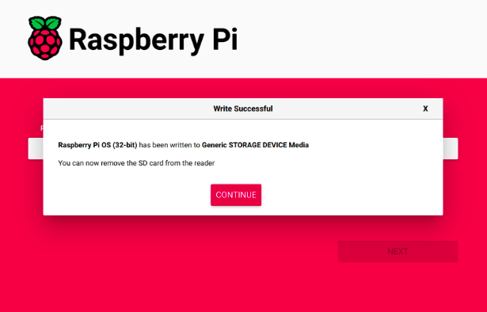

#### Встановлюємо SD в плату

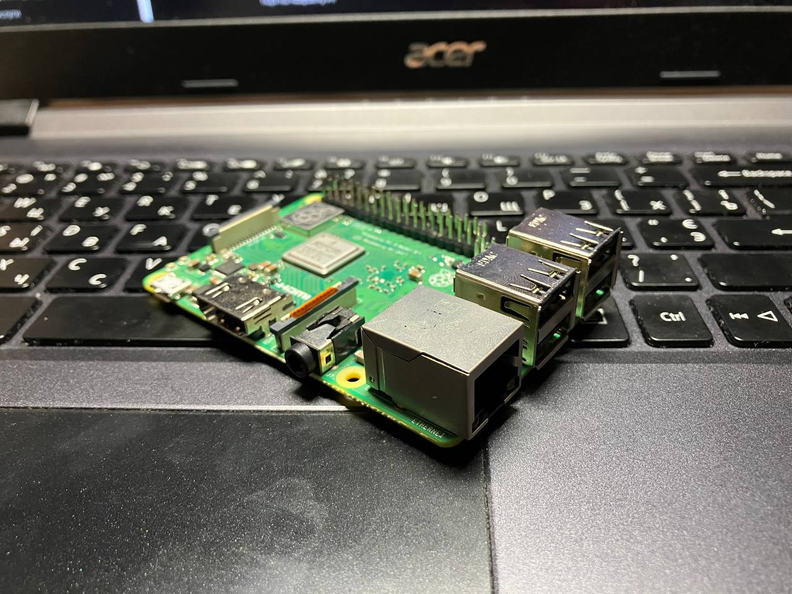

#### Піключаємо до живлення і Ethernet

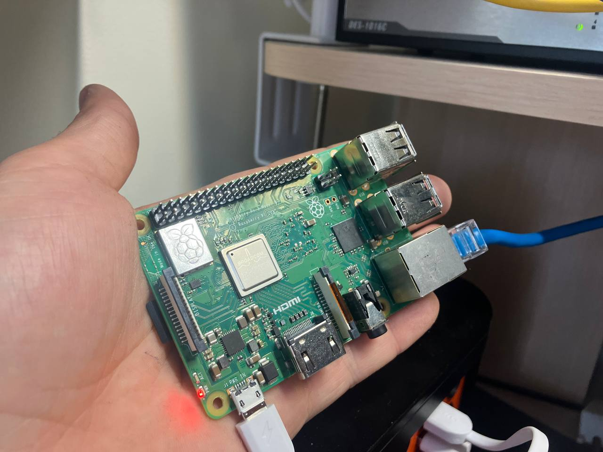

## Підключення по SSH до RaspBerry

### Скануємо всі ip в локальній мережі через nmap і шукаємо ip RaspBerry

``` Bash
# aspire 192.168.3.155
sudo apt install nmap
sudo nmap -sn 192.168.3.0/24
```

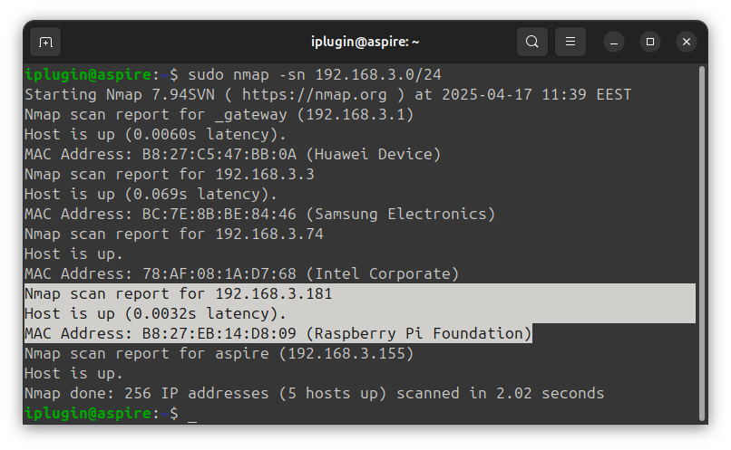

``` Bash
# aspire 192.168.3.155
ssh rasp@192.168.3.181
```

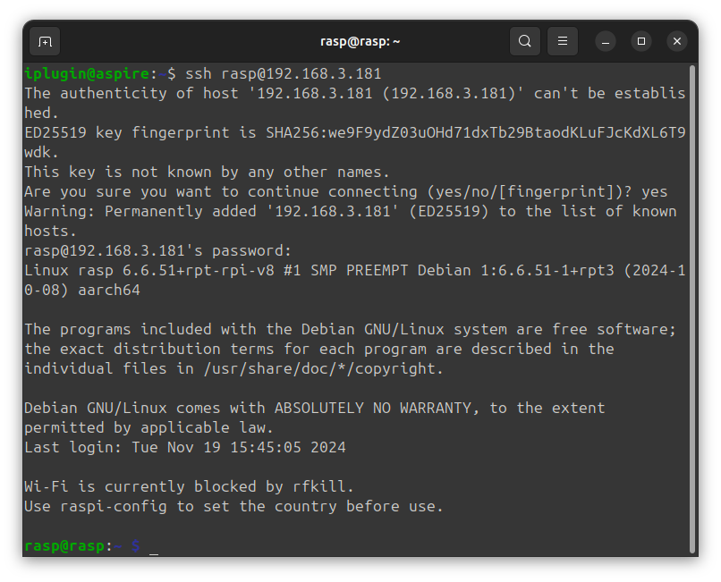

## Перенесення PHP файлу через SCP

``` Bash
# aspire 192.168.3.155 -> 192.168.86.144
# raspberry 192.168.3.181 -> 192.168.86.32
```

#### Створюємо робочу дерикторію

``` Bash
# raspberry 192.168.86.32
mkdir myFolder
```

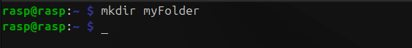

#### Переносимо файл

``` Bash
# aspire 192.168.86.144
ll Desktop/
scp Desktop/file.php rasp@192.168.86.32:myFolder/
```

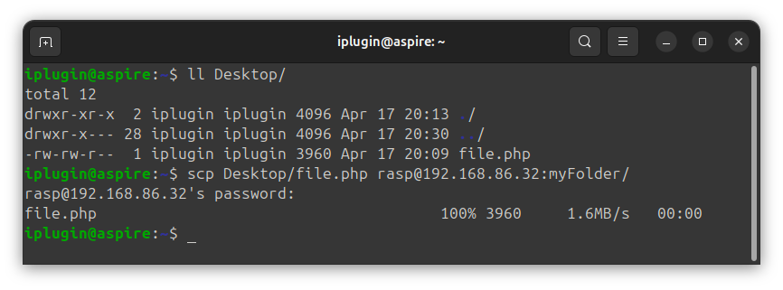

## Налаштування веб-серверу Apache

``` Bash
# raspberry 192.168.86.32
sudo apt update && sudo apt upgrade
sudo apt install apache2 -y
```

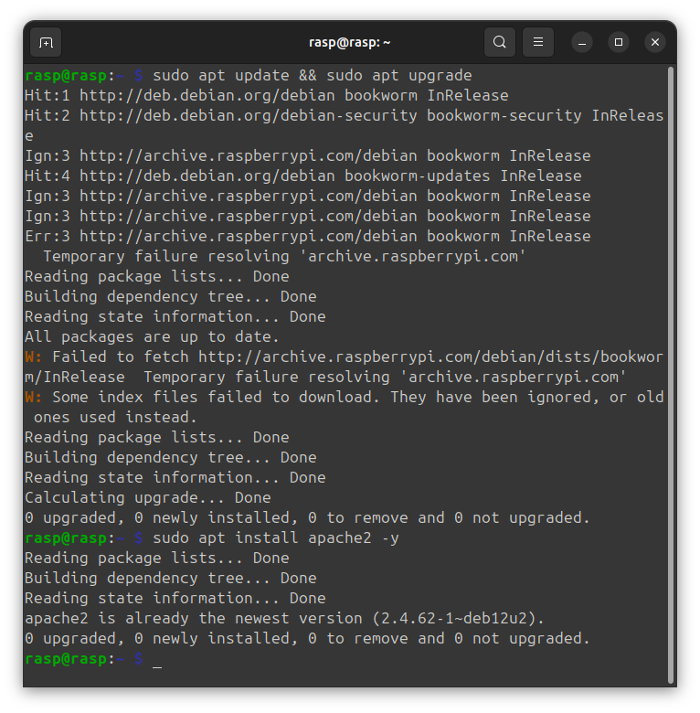


``` Bash
# raspberry 192.168.86.32
sudo mv myFolder/file.php /var/www/html/
cd /var/www/html
ls -al
sudo chown rasp: file.html
```


``` Bash
# raspberry 192.168.86.32
sudo apt install php libapache2-mod-php -y
cat file.php
```

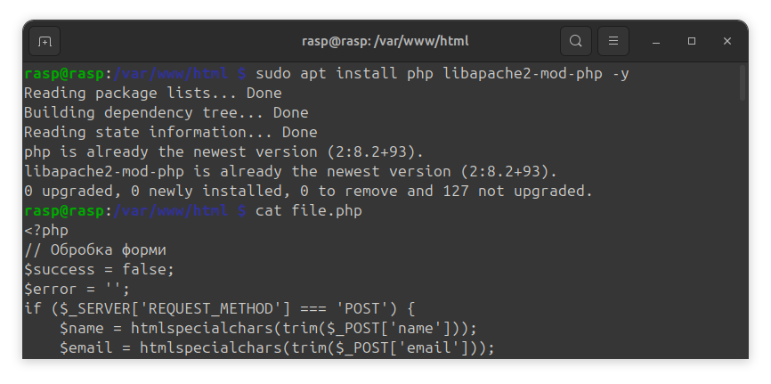

``` Google request
# aspire 192.168.86.144
Google request: 192.168.86.32
```

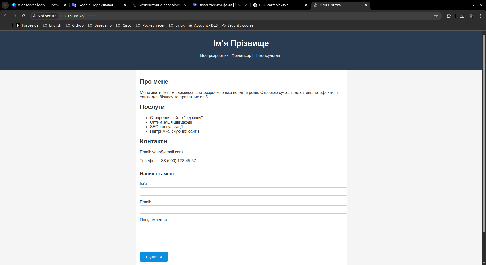